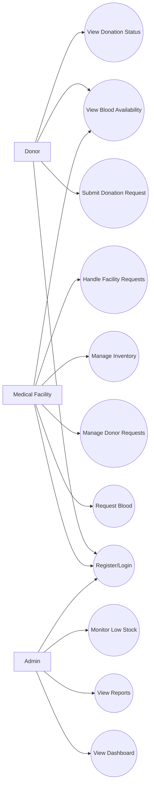
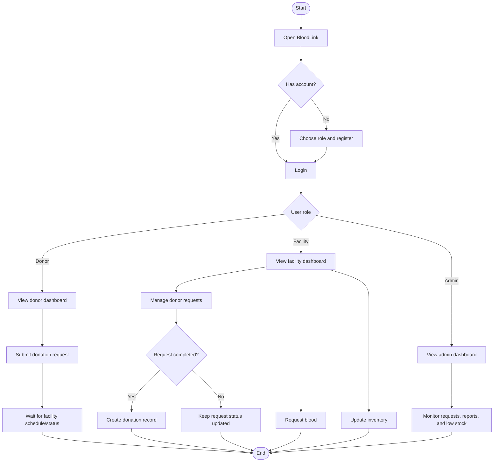
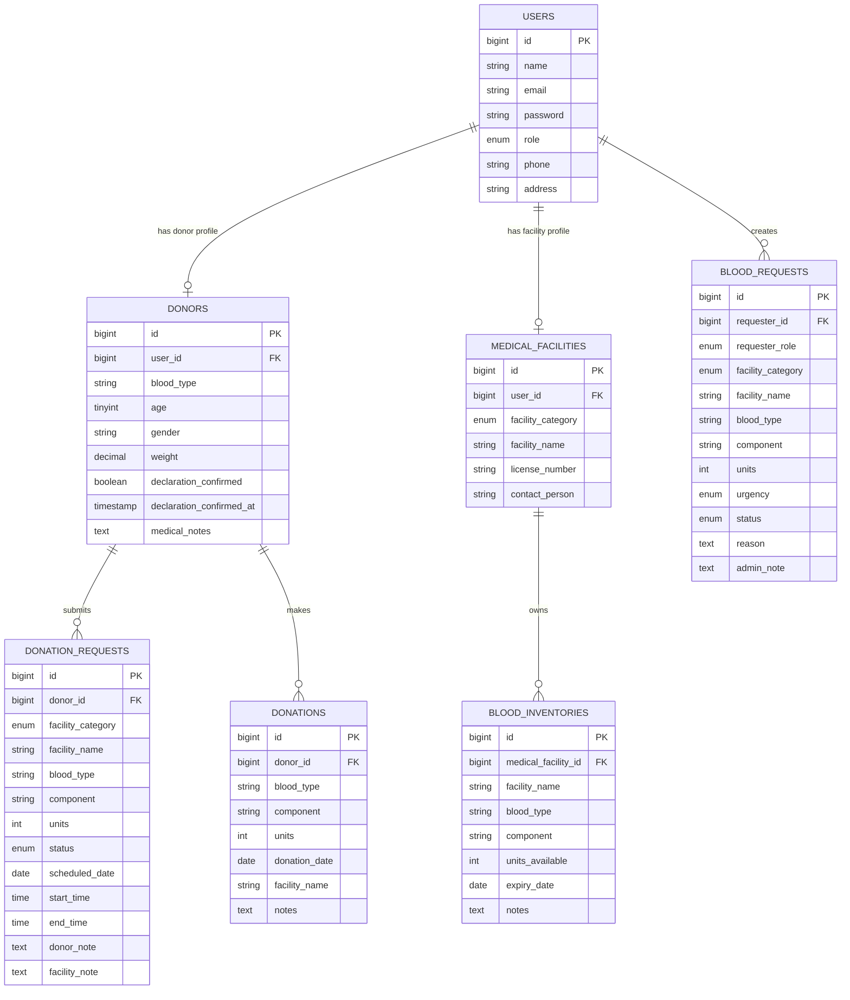
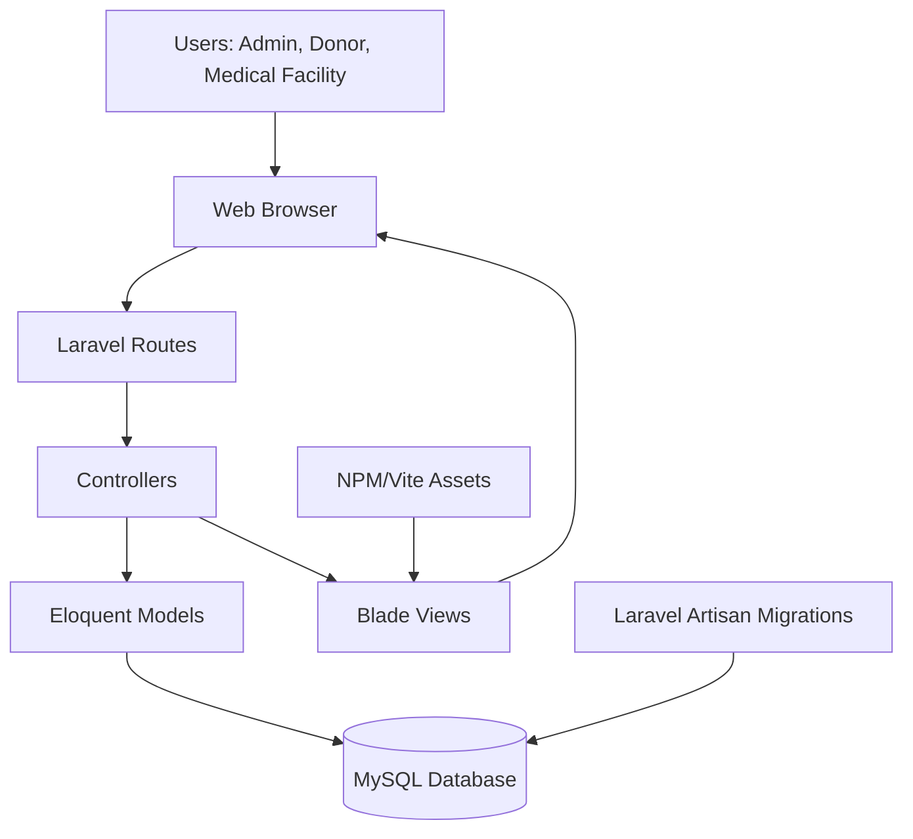

# BloodLink Laravel Blood Bank Management System

## Title Page

**Project Title:** BloodLink Laravel Blood Bank Management System  
**Names of Members:** [Insert member names]  
**Course/Subject:** [Insert course or subject]  
**Instructor's Name:** [Insert instructor's name]  
**Date Submitted:** May 21, 2026  

## 1. Introduction

### Background of the Study

Blood donation and blood supply management are important parts of public health service delivery. Hospitals, rural health units, and blood service organizations need an organized way to monitor blood availability, receive requests, schedule donors, and maintain accurate inventory records. Manual tracking through paper records, separate spreadsheets, or informal communication can cause delays, duplicated records, missed donor schedules, and difficulty locating available blood units during urgent situations.

BloodLink is a web-based Blood Bank Management System developed using Laravel. The system provides a centralized platform where donors, medical facilities, and administrators can manage blood donation requests, blood requests, inventory records, and reporting activities. It is designed for local deployment using PHP, Laravel, MySQL, and XAMPP/phpMyAdmin.

### Purpose of the System

The purpose of BloodLink is to improve the organization and accessibility of blood bank information. The system allows donors to register and submit donation appointment requests, medical facilities to manage donor schedules and inventory, and administrators to monitor requests, reports, users, and low-stock blood supplies.

### Importance of the Project

This project is important because it supports faster access to blood availability information and helps reduce delays in coordinating donations and requests. By using a database-driven web application, records become easier to store, retrieve, update, and monitor. The system also helps medical facilities communicate blood needs and manage donor appointments more efficiently.

### Problems the System Aims to Solve

BloodLink aims to solve the following problems:

- Difficulty tracking available blood units by type, component, and facility.
- Delays in processing donor appointment requests.
- Lack of centralized records for donors, medical facilities, donations, and blood requests.
- Inefficient communication between facilities that need blood and facilities that may have available supply.
- Limited visibility of low-stock blood inventory.
- Difficulty generating reports for users, requests, donations, and inventory.

## 2. Objectives of the System

### General Objective

The general objective of the project is to develop a web-based Blood Bank Management System that helps donors, medical facilities, and administrators manage blood donation activities, blood requests, inventory records, and system reports in an organized and accessible platform.

### Specific Objectives

The specific objectives of the system are:

- To provide user registration and login for donors, medical facilities, and administrators.
- To allow donors to submit blood donation appointment requests.
- To allow facilities to approve, reject, schedule, and complete donor requests.
- To allow medical facilities to request blood from other facilities.
- To allow facilities to post and update blood inventory by blood type and component.
- To display available blood inventory to users.
- To provide administrative dashboards for monitoring users, donors, facilities, requests, donations, and low stock alerts.
- To store all important records in a structured MySQL database.
- To improve the speed, accuracy, and organization of blood bank record management.

## 3. Scope and Limitations

### Scope of the System

BloodLink includes the following functions:

- Role-based registration for donors, medical facilities, and administrators.
- Login and logout using Laravel session handling.
- Donor profile creation with blood type, age, gender, weight, and donor declaration confirmation.
- Donor donation request submission.
- Facility review and scheduling of donor requests with date and time range.
- Facility blood request submission with urgency level and reason.
- Facility approval, rejection, and release tracking for addressed blood requests.
- Facility inventory posting for blood types and blood components.
- Public blood availability viewing.
- Admin dashboard with user, donor, facility, inventory, pending request, donation, and low-stock summaries.
- Admin reports for donors, facilities, inventory, donations, and monthly chart data.

### Limitations of the System

The system has the following limitations:

- It is designed for local deployment and testing through XAMPP, MySQL, and Laravel's development server.
- It does not include online payment, SMS notification, email notification, or mobile application support.
- It does not include automatic blood compatibility matching beyond recording blood type and component.
- It does not include laboratory screening results or advanced medical eligibility checking.
- It does not provide real-time inventory synchronization with external hospital systems.
- It depends on users and facility staff to update inventory and request statuses accurately.
- It does not include a complete audit trail for every record change.

## 4. System Description

### Overview of the System

BloodLink is a Laravel-based web application that manages blood donation and blood request workflows. The system uses role-based access to present different dashboards and features for donors, medical facilities, and administrators. Data is stored in a MySQL database using Laravel migrations and Eloquent models.

### Major Modules and Features

**Authentication Module**  
This module handles login, logout, role selection, and registration. Users may register as donors, facilities, or administrators. Session data stores the logged-in user's ID, role, and name.

**Donor Module**  
The donor module allows donors to register their personal and blood information, confirm their donor declaration, submit donation requests, and view their donation request status and available blood inventory.

**Facility Module**  
The facility module allows medical facilities to request blood, review incoming facility requests, manage donor appointment requests, schedule donors, mark donations as completed, and maintain blood inventory records.

**Admin Module**  
The admin module allows administrators to view system totals, pending requests, recent donations, low stock inventory, blood requests, and reports.

**Inventory Module**  
The inventory module records available blood units by medical facility, blood type, and component. Facilities can add units for whole blood, platelets, and plasma.

**Reports Module**  
The reports module displays donor, facility, inventory, donation, user, and request information. It also prepares monthly data for chart visualization.

### User Roles and Functionalities

**Admin**

- View dashboard summaries.
- Monitor users, donors, facilities, inventory units, pending requests, and low-stock items.
- View blood requests.
- View system reports.
- Create default admin and facility accounts for setup.

**Donor**

- Register and provide donor information.
- Confirm donor declaration.
- Submit donation appointment requests.
- View donation request history and statuses.
- View available blood inventory.

**Medical Facility**

- Register facility information.
- Request blood from facilities.
- Review incoming facility blood requests.
- Approve, reject, or release addressed blood requests.
- Review donor requests addressed to the facility.
- Schedule donor appointments.
- Mark donations as completed.
- Add blood inventory units by blood type and component.

## 5. Technologies Used

### Programming Languages

- **PHP** - Main server-side programming language used by Laravel.
- **JavaScript** - Used for frontend asset bundling and client-side support.
- **HTML and CSS** - Used for Blade views and interface styling.

### Frameworks and Libraries

- **Laravel 12** - Main PHP framework used for routing, controllers, models, validation, sessions, migrations, and database access.
- **Blade** - Laravel templating engine used for system views.
- **Bootstrap/custom CSS** - Used for interface layout and styling.
- **Vite** - Used for frontend asset building.
- **Tailwind CSS dependency** - Included in the frontend development dependencies.
- **Axios** - Included as a JavaScript HTTP client dependency.

### Database Management System

- **MySQL** - Database system configured for the application.
- **phpMyAdmin** - Used through XAMPP for database creation and management.

### Development Tools

- **XAMPP** - Provides Apache, PHP, MySQL, and phpMyAdmin for local development.
- **Composer** - PHP dependency manager used to install Laravel packages.
- **NPM** - JavaScript package manager used for frontend dependencies.
- **Laravel Artisan** - Command-line tool used for migrations, serving the app, and other Laravel tasks.
- **Visual Studio Code or similar editor** - Used for code editing and development.

## 6. System Design

### Use Case Diagram

### Flowchart

### ER Diagram / Database Design

### System Architecture Diagram

### Interface Design / Screenshots

The system interface is organized into role-based pages:

- **Home Page** - Provides system entry point and navigation.
- **Login Page** - Allows registered users to access the system.
- **Role Selection Page** - Allows users to choose donor, facility, or admin registration.
- **Donor Dashboard** - Shows donor details, donation requests, statuses, and available blood inventory.
- **Donation Request Page** - Allows donors to submit donation appointment requests.
- **Facility Dashboard** - Shows facility blood requests, incoming requests, donor requests, and inventory records.
- **Facility Inventory Page** - Allows facilities to add blood units by type and component.
- **Facility Donor Requests Page** - Allows facilities to approve, reject, schedule, and complete donor requests.
- **Admin Dashboard** - Shows system totals, pending requests, recent donations, and low-stock alerts.
- **Admin Reports Page** - Shows donor, facility, inventory, donation, and monthly chart information.

Screenshots may be inserted in this section after running the system locally at `http://127.0.0.1:8001`.

## 7. Database Structure

### users

Stores login and profile information for all system users.

| Field | Description |
| --- | --- |
| id | Primary key |
| name | Full name of the user |
| email | Unique email address |
| email_verified_at | Optional email verification timestamp |
| password | Hashed password |
| role | User role: admin, donor, or facility |
| phone | Optional contact number |
| address | Optional address |
| remember_token | Laravel remember token |
| created_at, updated_at | Record timestamps |

### donors

Stores donor-specific profile information.

| Field | Description |
| --- | --- |
| id | Primary key |
| user_id | Foreign key connected to users |
| blood_type | Donor blood type |
| age | Donor age |
| gender | Donor gender |
| weight | Donor weight |
| declaration_confirmed | Confirms donor declaration |
| declaration_confirmed_at | Timestamp of declaration confirmation |
| medical_notes | Optional medical notes |
| created_at, updated_at | Record timestamps |

### medical_facilities

Stores facility-specific profile information.

| Field | Description |
| --- | --- |
| id | Primary key |
| user_id | Foreign key connected to users |
| facility_category | Hospital, Rural Health Unit, or Red Cross |
| facility_name | Name of medical facility |
| license_number | Optional facility license number |
| contact_person | Optional facility contact person |
| created_at, updated_at | Record timestamps |

### blood_inventories

Stores blood inventory records by facility, blood type, and component.

| Field | Description |
| --- | --- |
| id | Primary key |
| medical_facility_id | Foreign key connected to medical_facilities |
| facility_name | Facility name |
| blood_type | Blood type |
| component | Blood component |
| units_available | Number of available units |
| expiry_date | Optional expiry date |
| notes | Optional notes |
| created_at, updated_at | Record timestamps |

### donation_requests

Stores donor appointment requests.

| Field | Description |
| --- | --- |
| id | Primary key |
| donor_id | Foreign key connected to donors |
| facility_category | Target facility category |
| facility_name | Target facility name |
| blood_type | Donor blood type |
| component | Blood component |
| units | Number of units |
| status | pending, approved, rejected, or completed |
| scheduled_date | Appointment date |
| start_time | Appointment start time |
| end_time | Appointment end time |
| donor_note | Optional donor note |
| facility_note | Optional facility note |
| created_at, updated_at | Record timestamps |

### blood_requests

Stores blood requests submitted by medical facilities.

| Field | Description |
| --- | --- |
| id | Primary key |
| requester_id | Foreign key connected to users |
| requester_role | Role of requester, currently facility |
| facility_category | Target facility category |
| facility_name | Target facility name |
| blood_type | Requested blood type |
| component | Requested blood component |
| units | Requested number of units |
| urgency | low, medium, high, or critical |
| status | pending, approved, rejected, or released |
| reason | Reason for request |
| admin_note | Status note or response note |
| created_at, updated_at | Record timestamps |

### donations

Stores completed donation records.

| Field | Description |
| --- | --- |
| id | Primary key |
| donor_id | Foreign key connected to donors |
| blood_type | Donated blood type |
| component | Donated blood component |
| units | Number of donated units |
| donation_date | Date of donation |
| facility_name | Facility where donation was completed |
| notes | Optional notes |
| created_at, updated_at | Record timestamps |

### Relationships Between Tables

- A user can have one donor profile.
- A user can have one medical facility profile.
- A donor can submit many donation requests.
- A donor can have many completed donation records.
- A medical facility can have many blood inventory records.
- A user with the facility role can create many blood requests.
- Blood requests are addressed to a facility by facility name and category.

## 8. Implementation and Testing

### Development Process

The system was developed using the Laravel framework. The database schema was created through Laravel migration files. Models were created for users, donors, medical facilities, blood inventories, blood requests, donation requests, and donations. Controllers were used to separate system logic according to the main roles and modules.

The development process followed these steps:

1. Set up the Laravel project environment.
2. Configure the MySQL database connection in the `.env` file.
3. Create migrations for users and blood bank-related tables.
4. Create Eloquent models and relationships.
5. Build authentication pages for login and registration.
6. Build role-based dashboards for admin, donor, and facility users.
7. Implement donor request submission.
8. Implement facility donor scheduling, blood requests, and inventory management.
9. Implement admin dashboards and reports.
10. Test the system using local server execution and sample data.

### Testing Procedures Performed

The following testing procedures were performed or prepared for the system:

- Registration testing for donor and facility accounts.
- Login testing for valid and invalid credentials.
- Role access testing to verify that users access only their allowed pages.
- Donor request testing to confirm that donation requests are stored correctly.
- Facility scheduling testing to confirm that approved schedules require a date, start time, and end time.
- Validation testing to confirm that invalid or missing form inputs are rejected.
- Inventory testing to verify that facilities can add blood units by type and component.
- Blood request testing to verify request status changes.
- Dashboard testing to confirm that counts, recent records, and low-stock alerts display correctly.
- Database testing using migrations and phpMyAdmin to verify table creation and stored records.

### Problems Encountered

Possible problems encountered during development include:

- Designing a database structure that supports different user roles.
- Preventing unauthorized users from accessing role-specific pages.
- Handling donor scheduling with valid date and time ranges.
- Managing inventory records for multiple blood types and components.
- Ensuring that donor requests and facility blood requests use consistent statuses.
- Preparing reports that summarize records accurately.

### Solutions Applied

The following solutions were applied:

- A `role` field was added to the users table to support admin, donor, and facility accounts.
- Controllers include role checks before allowing access to protected functions.
- Laravel validation rules were used to check required fields, accepted declarations, valid facility names, numeric unit counts, and correct date/time formats.
- Eloquent models were used to simplify database operations and relationships.
- Separate tables were created for donors, medical facilities, blood inventories, donation requests, blood requests, and donations.
- Dashboard queries were used to count users, donors, facilities, inventory units, pending requests, low-stock records, and recent transactions.

## 9. Conclusion

The BloodLink Laravel Blood Bank Management System successfully provides a web-based platform for managing blood donation and blood request activities. It supports donor registration, donation request submission, facility scheduling, facility blood requests, inventory management, and administrative monitoring.

The system benefits donors by giving them a clear way to submit donation requests and track status. It benefits medical facilities by helping them manage donor schedules, inventory, and blood requests. It benefits administrators by providing dashboards and reports for monitoring system activity and blood stock conditions.

During development, the project strengthened understanding of Laravel routing, controllers, models, migrations, Blade views, validation, sessions, role-based access, and database design. It also demonstrated the importance of structured records and organized workflows in healthcare-related information systems.

## 10. Recommendations

The following improvements are recommended for future development:

- Add email or SMS notifications for donor schedules, request approvals, and urgent blood needs.
- Add automatic blood compatibility checking.
- Add expiry tracking alerts for blood inventory.
- Add a stronger admin approval workflow for facility account verification.
- Add printable reports and downloadable PDF summaries.
- Add a mobile-friendly donor notification interface.
- Add audit logs for inventory and status changes.
- Add search and filtering tools for requests, donors, facilities, and inventory.
- Add map/location support to help users find nearby facilities.
- Add backup and restore features for database safety.
- Add laboratory screening and eligibility result recording for completed donations.

## Grading Criteria Reference

| Criteria | Percentage |
| --- | ---: |
| Completeness of Content | 30% |
| Organization and Structure | 20% |
| Technical Discussion | 20% |
| System Design and Documentation | 15% |
| Grammar and Professional Writing | 10% |
| Proper Formatting | 5% |
| **Total** | **100%** |
